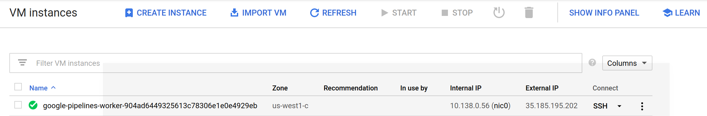
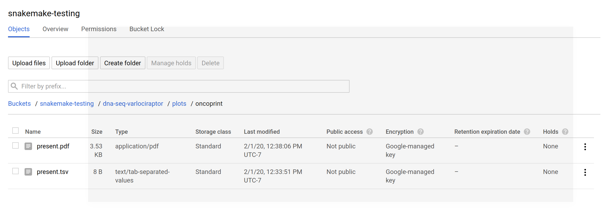

# dna-seq-varlociprator

This tutorial will use the [dna-seq-velociraptor](https://github.com/snakemake-workflows/dna-seq-varlociraptor) pipeline with the Google Life Sciences API.
 
## 1. Install dependencies

You will first need snakemake to run the workflow, along with the repository
that has the Snakefile (the recipe that specifies how to run the workflow).

### Host Dependencies

First, here are the basics for snakemake. If you already have git and the gcc
compiler just skip this step.

```bash
sudo apt-get update
sudo apt-get install -y git gcc
```

You likely already have Python, but if not, here is an example for installing
anaconda.

```bash
$ wget https://repo.anaconda.com/archive/Anaconda3-2019.10-Linux-x86_64.sh
$ chmod +x Anaconda3-2019.10-Linux-x86_64.sh 
$ ./Anaconda3-2019.10-Linux-x86_64.sh -b -p $HOME/anaconda3
```

Add to our path (edit in your bash profile to make permanent, if desired).

```bash
export PATH=$HOME/anaconda3/bin:$PATH
which python
/home/vanessa/anaconda3/bin/python

python --version
Python 3.7.4

which pip
/home/vanessa/anaconda3/bin/pip
```

### Snakemake

Since we are testing the Google Life Sciences integration (which is still
under development on a branch) we need to install that:

```bash
git clone -b add/google-cloud-pipelines https://github.com/vsoch/snakemake
cd snakemake
pip install .
```

And ensure it installed successfully and snakemake is on your path.

```bash
$ which snakemake
/home/vanessa/anaconda3/bin/snakemake
```

Finally, we need ftputil to support obtaining the data. That can also be
installed with pip.

```bash
pip install ftputil
```

### Google API Python Clients

Google always suggests that you upgrade your python clients, so let's do that.
Also, these aren't provided by default with Snakemake (there are many users that want
to use Snakemake in a context outside of Google). However, we need them.

```bash
pip install --upgrade google-api-python-client
pip install --upgrade google-cloud-storage
pip install oauth2client
```

If you haven't yet, create a Google Storage Bucket in the interface.
The Google Compute Engine instances will use this storage for intermediate
artifacts. You'll want to be sure to add pipelines service accounts to your Storage bucket users.
This step is hairy and error prone and I never really get it right the first time.

### Dna Seq Varlociprator

Let's clone the repository with the Snakemake workflow!

```bash
git clone https://github.com/snakemake-workflows/dna-seq-varlociraptor
cd dna-seq-varlociraptor
```

or if you use ssl, this is how you would clone:

```bash
git clone git@github.com:snakemake-workflows/dna-seq-varlociraptor
cd dna-seq-varlociraptor
```

Snakemake requires GOOGLE_APPLICATION_CREDENTIALS, and since you might want to
run this is (non Google places) too, you should [download your service account](https://console.cloud.google.com/iam-admin/iam)
key and export it to the environment.

```bash
export GOOGLE_APPLICATION_CREDENTIALS="/home/[username]/credentials.json"
```

## 4. Run Snakemake

Now let's test running Snakemake! Here we are in the root folder of the kim-wxs-varlociraptor repository. The snakefile we are targeting is in the "workflow" folder.


### Running from the Command Line

Let's run snakemake from the command line. Let's first discuss some flags you likely aren't familiar
with yet:

 - `--google-life-sciences`: to indicate that we want to use the Google Life Sciences API
 - `--default-remote-prefix`: refers to the Google Storage bucket. The bucket name is "snakemake-testing" and the "subfolder" (or path) is the name of the workflow.
 - `--google-life-sciences-keep-cache`: indicates that the working directory that is compressed, uploaded to storage, and then deployed to the worker should be kept for later use. You will find these files in your storage bucket under source/cache, and they are named by the hash of the content added.
 - `--google-lifesciences-region`: the region that you want the instances to deploy to. Your storage bucket should be accessible from here, and your selection can have a small influence on the machine type selected.
 -  `--container-image`: is the base image of snakemake to use. Since snakemake is developed and changes fairly quickly, you should make sure that you are using a [tag](https://hub.docker.com/r/snakemake/snakemake/tags) that has all the features that your pipeline needs. In this case, we need this particular version to have support for the "multiext" function you see in some of the rules.

We aren't providing the snakefile (it will be discovered under workflow/snakemake.

```bash
$ snakemake --google-lifesciences --default-remote-prefix snakemake-testing/dna-seq-varlociraptor --use-conda --google-lifesciences-keep-cache --google-lifesciences-region us-west1 --container-image snakemake/snakemake:v5.10.0
```

You'll see output printed to the screen. 

```
Building DAG of jobs...
Using shell: /bin/bash
Provided cores: 9223372036854775807
Rules claiming more threads will be scaled down.
Job counts:
	count	jobs
	1	all
	1	build_oncoprint_table
	1	plot_oncoprint
	3

[Sat Feb  1 12:30:27 2020]
rule build_oncoprint_table:
    output: snakemake-testing/dna-seq-varlociraptor/plots/oncoprint/present.tsv
    jobid: 2
    wildcards: event=present

Get status with:
gcloud config set project snakemake-testing
gcloud beta lifesciences operations describe 1264563821085236371
gcloud beta lifesciences operations list
Worker released
Stopped running "snakejob-build_oncoprint_table-2": 100% 31.7M=0s

2020-02-01 19:32:20 (31.7 MB/s) - ‘/download.py’ saved [1246/1246]

Building DAG of jobs...
Creating conda environment workflow/envs/oncoprinttable.yaml...
Downloading and installing remote packages.
Environment for workflow/envs/oncoprinttable.yaml created (location: .snakemake/conda/c6778805)
Using shell: /bin/bash
Provided cores: 1 (use --cores to define parallelism)
Rules claiming more threads will be scaled down.
Job counts:
	count	jobs
	1	build_oncoprint_table
	1

[Sat Feb  1 19:33:48 2020]
rule build_oncoprint_table:
    output: snakemake-testing/dna-seq-varlociraptor/plots/oncoprint/present.tsv
    jobid: 0
    wildcards: event=present

Activating conda environment: /workdir/.snakemake/conda/c6778805
Uploading to remote: snakemake-testing/dna-seq-varlociraptor/plots/oncoprint/present.tsv
Finished upload.
[Sat Feb  1 19:33:51 2020]
Finished job 0.
1 of 1 steps (100%) done
Complete log: /workdir/.snakemake/log/2020-02-01T193224.972289.snakemake.log
Started running "snakejob-build_oncoprint_table-2"
Stopped pulling "snakemake/snakemake:v5.10.0"
Started pulling "snakemake/snakemake:v5.10.0"
Worker "google-pipelines-worker-904ad6449325613c78306e1e0e4929eb" assigned in "us-west1-c"
[Sat Feb  1 12:33:59 2020]
Finished job 2.
1 of 3 steps (33%) done

[Sat Feb  1 12:33:59 2020]
rule plot_oncoprint:
    input: snakemake-testing/dna-seq-varlociraptor/plots/oncoprint/present.tsv
    output: snakemake-testing/dna-seq-varlociraptor/plots/oncoprint/present.pdf
    jobid: 1
    wildcards: event=present

Get status with:
gcloud config set project snakemake-testing
gcloud beta lifesciences operations describe 13321012366542853386
gcloud beta lifesciences operations list
Worker released
Stopped running "snakejob-plot_oncoprint-1": ing/dna-seq-varlociraptor/plots/oncoprint/present.pdf
    jobid: 0
    wildcards: event=present

Downloading from remote: snakemake-testing/dna-seq-varlociraptor/plots/oncoprint/present.tsv
Finished download.
Activating conda environment: /workdir/.snakemake/conda/f859ed29
Loading required package: grid
========================================
ComplexHeatmap version 2.2.0
Bioconductor page: http://bioconductor.org/packages/ComplexHeatmap/
Github page: https://github.com/jokergoo/ComplexHeatmap
Documentation: http://jokergoo.github.io/ComplexHeatmap-reference

If you use it in published research, please cite:
Gu, Z. Complex heatmaps reveal patterns and correlations in multidimensional 
  genomic data. Bioinformatics 2016.
========================================

Uploading to remote: snakemake-testing/dna-seq-varlociraptor/plots/oncoprint/present.pdf
Finished upload.
[Sat Feb  1 19:38:06 2020]
Finished job 0.
1 of 1 steps (100%) done
Complete log: /workdir/.snakemake/log/2020-02-01T193600.692552.snakemake.log
Started running "snakejob-plot_oncoprint-1"
Stopped pulling "snakemake/snakemake:v5.10.0"
Started pulling "snakemake/snakemake:v5.10.0"
Worker "google-pipelines-worker-77c3e460b711dc13d5d7a6910e0ef2d5" assigned in "us-west1-c"
[Sat Feb  1 12:38:11 2020]
Finished job 1.
2 of 3 steps (67%) done

[Sat Feb  1 12:38:11 2020]
localrule all:
    input: snakemake-testing/dna-seq-varlociraptor/plots/oncoprint/present.pdf
    jobid: 0

Downloading from remote: snakemake-testing/dna-seq-varlociraptor/plots/oncoprint/present.pdf
Finished download.
[Sat Feb  1 12:38:11 2020]
Finished job 0.
3 of 3 steps (100%) done
Complete log: /home/vanessa/Documents/Dropbox/Code/Python/snakemake/snakemake-tutorials/dna-seq-varlociraptor/dna-seq-varlociraptor/.snakemake/log/2020-02-01T123026.287730.snakemake.log
```

The log is [included here](2020-02-01T123026.287730.snakemake.log) for your inspection.  If you look at the [Google Compute Engine](https://console.cloud.google.com/compute/instances) console, you'll see that you have created a google-pipelines-worker instance!




And the files are generated under the prefix you specified in Google Storage:



If you need to debug further, you can add `--verbose`. 


### Running from within Python

Although this is more complicated, you might have a case when you want more 
a more interactive environment to use snakemake. Note that
we are using ipython in the root of the repository that we've cloned.

```python
from snakemake import snakemake
import os
workdir = os.getcwd()
```

Add the present working directory to the Python path:

```python
os.environ['PYTHONPATH'] = os.getcwd()
```

We want to provide the *relative* path to the snakefile

```python
snakefile = 'workflow/Snakefile'
```

And now create a temporary directory for working:

```python
import tempfile
tmpdir = next(tempfile._get_candidate_names()) 
tmpdir = os.path.join(tempfile.gettempdir(), "snakemake-%s" % tmpdir) 
os.mkdir(tmpdir) 
```

Copy all our files there.

```python
import shutil

def copy(src, dst): 
    if os.path.isdir(src): 
        shutil.copytree(src, os.path.join(dst, os.path.basename(src))) 
    else: 
        shutil.copy(src, dst) 

path = os.getcwd()
for f in os.listdir(path): 
    print(f) 
    copy(os.path.join(path, f), tmpdir) 

.gitattributes
.snakemake
.gitignore
.test
README.md
config
.git
LICENSE
.gitmodules
.editorconfig
.github
snakeworkdir-c14b0c4e2a7c623030d7635459a969ae84a9d327975a0ecbef4b54ef6ade63f2.tar.gz
workflow
```

Let's get ready to run! These are the same parameters used in testing.

```python
cores = 3
verbose = True
success = snakemake( 
    snakefile,
    cores=cores, 
    workdir=tmpdir, 
    use_conda=True,
    google_lifesciences_regions=["us-west1"],
    default_remote_prefix="snakemake-testing/dna-seq-varlocirator",
    container_image="snakemake/snakemake:v5.10.0"
    google_lifesciences=True,
    google_lifesciences_cache=True,
    verbose=True) 
```

And then the pipeline will run and print verbose output to the screen
akin to before.
