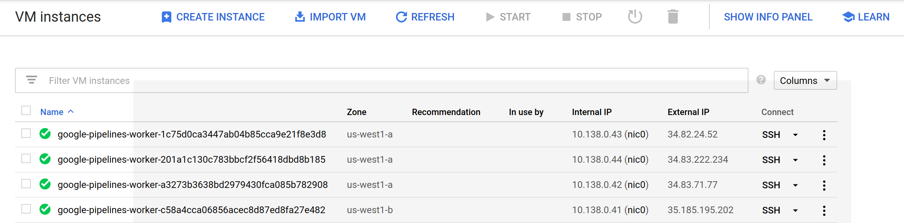
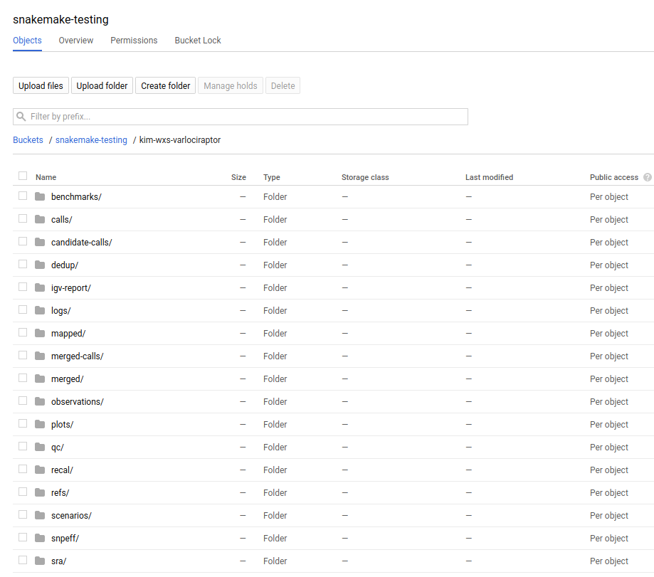
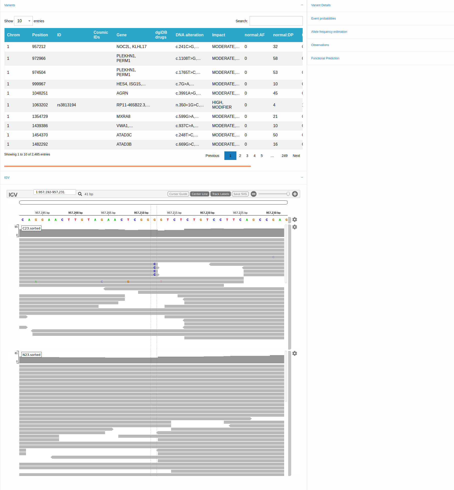

# kim-wxs-varlociprator

This tutorial will use the [kim-wxs-velociraptor](https://github.com/koesterlab/kim-wxs-varlociraptor) pipeline to do analysis of the [WXS dataset](https://doi.org/10.1158/2326-6066.CIR-17-0453) in with Varlociraptor. We will be working from
your local machine, running compute instances on Google cloud, and using data
that is mentioned in the paper. Snakemake is incredibly versatile with
respect to the [methods to interact with remote data](https://snakemake.readthedocs.io/en/stable/snakefiles/remote_files.html), so it's not an issue
that the data from the paper is not on Google Cloud.
 
## 1. Install dependencies

You will first need snakemake to run the workflow, along with the repository
that has the Snakefile (the recipe that specifies how to run the workflow).

### Host Dependencies

First, here are the basics for snakemake. If you already have git and the gcc
compiler just skip this step.

```bash
sudo apt-get update
sudo apt-get install -y git gcc
```

You likely already have Python, but if not, here is an example for installing
anaconda.

```bash
$ wget https://repo.anaconda.com/archive/Anaconda3-2019.10-Linux-x86_64.sh
$ chmod +x Anaconda3-2019.10-Linux-x86_64.sh 
$ ./Anaconda3-2019.10-Linux-x86_64.sh -b -p $HOME/anaconda3
```

Add to our path (edit in your bash profile to make permanent, if desired).

```bash
export PATH=$HOME/anaconda3/bin:$PATH
which python
/home/vanessa/anaconda3/bin/python

python --version
Python 3.7.4

which pip
/home/vanessa/anaconda3/bin/pip
```

### Snakemake

Since we are testing the Google Life Sciences integration (which is still
under development on a branch) we need to install that:

```bash
git clone -b add/google-cloud-pipelines https://github.com/vsoch/snakemake
cd snakemake
pip install .
```

And ensure it installed successfully and snakemake is on your path.

```bash
$ which snakemake
/home/vanessa/anaconda3/bin/snakemake
```

Finally, we need ftputil to support obtaining the data. That can also be
installed with pip, along with oauth2client.

```bash
pip install ftputil
pip install oauth2client
```

### Google API Python Clients

Google always suggests that you upgrade your python clients, so let's do that.
Also, these aren't provided by default with Snakemake (there are many users that want
to use Snakemake in a context outside of Google). However, we need them.

You can either do:

```bash
pip install snakemake[google-cloud]
```

or

```bash
pip install --upgrade google-api-python-client
pip install --upgrade google-cloud-storage
pip install oauth2client
pip install crc32c
```

If you haven't yet, create a Google Storage Bucket in the interface.
The Google Compute Engine instances will use this storage for intermediate
artifacts. You'll want to be sure to add pipelines service accounts to your Storage bucket users.
This step is hairy and error prone and I never really get it right the first time.

### Kim Wxs Varlociprator

Let's clone the repository with the Snakemake workflow!

```bash
git clone https://github.com/koesterlab/kim-wxs-varlociraptor
cd kim-wxs-varlociraptor
```

or if you use ssl, this is how you would clone:

```bash
git clone git@github.com:koesterlab/kim-wxs-varlociraptor
cd kim-wxs-varlociraptor
```

Snakemake requires GOOGLE_APPLICATION_CREDENTIALS, and since you might want to
run this is (non Google places) too, you should [download your service account](https://console.cloud.google.com/iam-admin/iam)
key and export it to the environment.

```bash
export GOOGLE_APPLICATION_CREDENTIALS="/home/[username]/credentials.json"
```

## 4. Run Snakemake

Now let's test running Snakemake! Here we are in the root folder of the kim-wxs-varlociraptor repository. The snakefile we are targeting is in the "workflow" folder.


### Running from the Command Line

Let's run snakemake from the command line. Let's first discuss some flags you likely aren't familiar
with yet:

 - `--google-lifesciences`: to indicate that we want to use the Google Life Sciences API
 - `--default-remote-prefix`: refers to the Google Storage bucket. The bucket name is "snakemake-testing" and the "subfolder" (or path) is the name of the workflow.
 - `--google-lifesciences-keep-cache`: indicates that the working directory that is compressed, uploaded to storage, and then deployed to the worker should be kept for later use. You will find these files in your storage bucket under source/cache, and they are named by the hash of the content added.
 - `--google-lifesciences-region`: the region that you want the instances to deploy to. Your storage bucket should be accessible from here, and your selection can have a small influence on the machine type selected.

We aren't providing the snakefile (it will be discovered under workflow/snakemake.

```bash
snakemake --google-lifesciences --default-remote-prefix snakemake-testing/kim-wxs-varlociraptor --use-conda --google-lifesciences-keep-cache --google-lifesciences-region us-west1
```

If you look at the [Google Compute Engine](https://console.cloud.google.com/compute/instances) console, you'll see that you have created google-pipelines-worker instances!



You'll see output printed to the screen. 

```
...
[Thu Feb 27 10:44:01 2020]
rule plot_oncoprint:
    input: snakemake-testing/kim-wxs-varlociraptor/plots/oncoprint/present.tsv
    output: snakemake-testing/kim-wxs-varlociraptor/plots/oncoprint/present.pdf
    log: snakemake-testing/kim-wxs-varlociraptor/logs/oncoprint/present.log
    jobid: 3
    wildcards: event=present
    resources: mem_mb=15360, disk_mb=128000

Get status with:
gcloud config set project snakemake-testing
gcloud beta lifesciences operations describe 154524398427669535
gcloud beta lifesciences operations list
[Thu Feb 27 10:47:53 2020]
Finished job 3.
1 of 2 steps (50%) done

[Thu Feb 27 10:47:53 2020]
localrule all:
    input: snakemake-testing/kim-wxs-varlociraptor/igv-report/23.present.html, snakemake-testing/kim-wxs-varlociraptor/plots/tmb/23.tmb.svg, snakemake-testing/kim-wxs-varlociraptor/plots/oncoprint/present.pdf
    jobid: 0
    resources: mem_mb=15360, disk_mb=128000

Downloading from remote: snakemake-testing/kim-wxs-varlociraptor/igv-report/23.present.html
Finished download.
Downloading from remote: snakemake-testing/kim-wxs-varlociraptor/plots/oncoprint/present.pdf
Finished download.
Downloading from remote: snakemake-testing/kim-wxs-varlociraptor/plots/tmb/23.tmb.svg
Finished download.
[Thu Feb 27 10:47:59 2020]
Finished job 0.
2 of 2 steps (100%) done
Complete log: /home/vanessa/Desktop/Code/snakemake/snakemake-tutorials/kim-wxs-varlociraptor/kim-wxs-varlociraptor/.snakemake/log/2020-02-27T104344.263446.snakemake.log
```
When the pipeline is finished, the entire hierarchy of output files will be in
Google Storage under the `--default-remote-prefix` that you've specified:



And the result files will have been downloaded locally! The two pdf plots are included
here under [snakemake-testing](snakemake-testing/kim-wxs-varlociraptor/plots/), however the `snakemake-testing/kim-wxs-varlociraptor/igv-report/23.present.html` is too large for GitHub, so a screenshot is shown below:



 If you need to debug further, you can add `--verbose`. 
